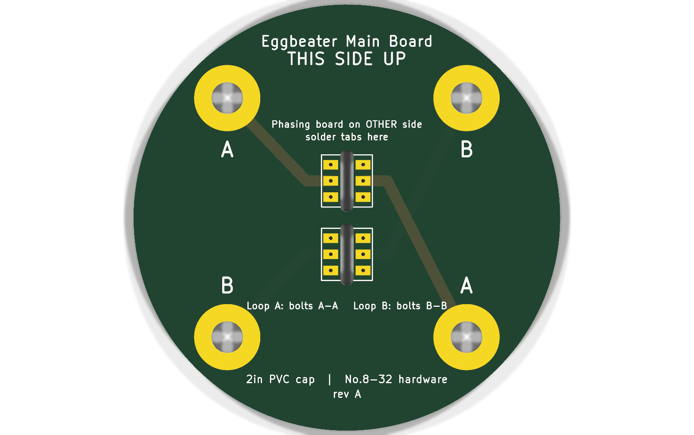
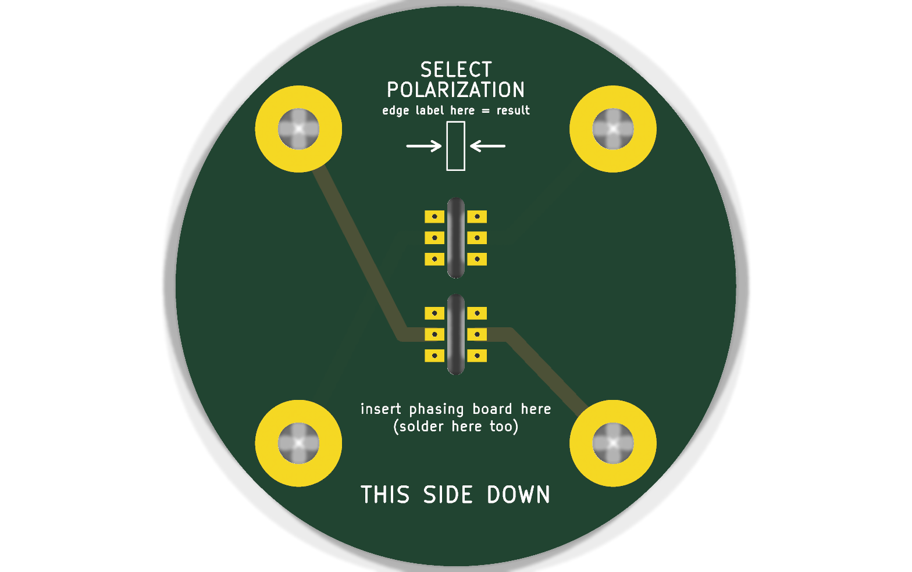
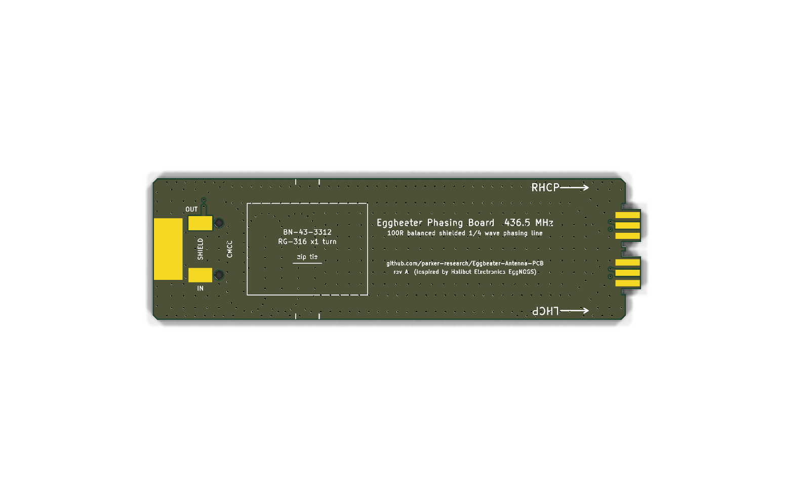
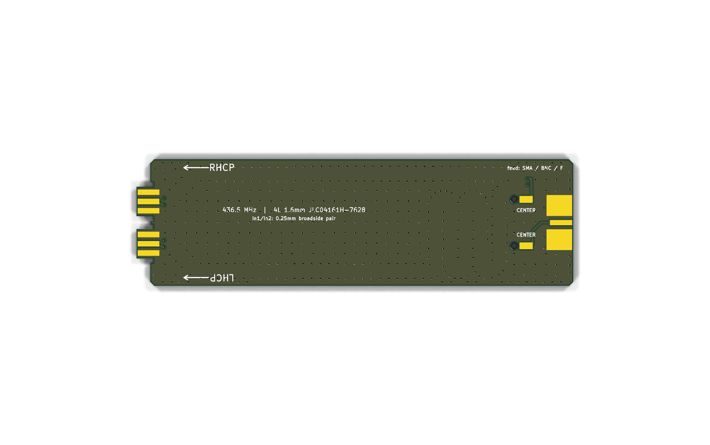

# Eggbeater Antenna PCB

An open KiCad re-implementation of a **PCB quadrature phasing feed for Egg Beater satellite antennas**. It works with two loops, a turnstile, or any other pair of balanced 100 Ω elements that need to be fed 90° apart.

The design is **inspired by and mechanically equivalent to the [Halibut Electronics EggNOGS](https://electronics.halibut.com/product/eggnogs/) kit**. It was reverse-engineered from the public product photos and the [EggNOGS Assembly Guide](https://halibut-electronics.github.io/EggNOGS/EggNOGS%20Assembly.pdf). No original design files were used. The transmission line, stackup and all dimensions were derived independently (see [Design](#design)). If you just want an antenna, buy the kit from Halibut Electronics and support the people who came up with the idea.

| Main board (UP side) | Main board (DOWN side) |
|---|---|
|  |  |

| Phasing board, front (ferrite side) | Phasing board, back (center-pin side) |
|---|---|
|  |  |

---

## How it works

```
 coax feed ─► edge SMA/BNC/F ─► CMCC balun ─┬─► direct path   (L)        ─► tab 1 ─► loop "A" bolts
 (50 Ω)                       RG-316 through │
                              BN-43-3312     └─► delayed path (L + λ/4)  ─► tab 2 ─► loop "B" bolts
                                   100 Ω balanced, shielded stripline (2 × 100 Ω in parallel = 50 Ω)
```

* **Balun / common-mode current choke:** a U of RG-316 passes once through a BN-43-3312 binocular core. The input end connects to the feed connector. At the output end, the braid and the center conductor become the two balanced conductors, `LINE_P` and `LINE_N`.
* **Phasing line:** a 100 Ω **balanced and shielded** transmission line built inside the 4-layer phasing board.
  * The two conductors are stacked on top of each other: `LINE_P` on In1.Cu and `LINE_N` on In2.Cu (a broadside-coupled pair).
  * Solid GND planes on F.Cu and B.Cu form the shield, closed at the sides by via fences.
  * The line splits right at the balun into two paths. The delayed path is 81.2 mm longer, which is one quarter wavelength at 436.5 MHz inside the board. Each loop presents 100 Ω and terminates its own 100 Ω line, so the two paths in parallel present 50 Ω to the balun.
* **Main board:** two slots take the phasing board's tabs at 90°. Traces run from the slot pads to four No. 8 bolts, and the two loops attach across opposite bolts (A–A and B–B).
* **Polarization select:** flipping the phasing board 180° before soldering swaps which loop gets the delayed feed, which switches between RHCP and LHCP. The phasing board's long edges are labeled `RHCP →` and `LHCP →`. Whichever label sits at the **SELECT POLARIZATION** mark on the main board's DOWN side is the polarization you get.

---

## Repository layout

```
kicad/main_board/        main_board.kicad_pro / .kicad_pcb       (2-layer, Ø58 mm)
kicad/phasing_board/     phasing_board.kicad_pro / .kicad_pcb    (4-layer, 436.5 MHz)
fab/*/                   *_gerbers.zip  (Gerber X2 + Excellon, ready to upload to JLCPCB)
scripts/generate_boards.py   parametric generator (Python stdlib only)
scripts/stripline_solver.py  2-D field solver used to size the line (numpy + scipy)
scripts/build.sh             generate → upgrade → refill zones → DRC → gerbers → renders
docs/img/                    3-D renders
```

The boards are generated by `scripts/generate_boards.py`, and every dimension is a named constant there. Rebuild with:

```sh
./scripts/build.sh            # default 436.5 MHz
./scripts/build.sh 145.9      # e.g. a 2 m phasing board (the meander grows automatically)
```

This needs KiCad ≥ 9 (`kicad-cli`) and Python 3. The generator also fits 145.9 MHz and 137.5 MHz on the same 30 × 100 mm board, using seven meanders instead of two. Only the 436.5 MHz board is committed and DRC-checked. There is no schematic: these are transmission-line boards defined entirely by their layout, like the original.

---

## Design

### Phasing board transmission line

JLCPCB **JLC04161H-7628** stackup, 1.6 mm:

| Layer | Thickness | Use |
|---|---|---|
| F.Cu (1 oz) | 0.035 | GND shield, CMCC braid pads, tab pads (front) |
| 7628 prepreg, εr 4.4 | 0.2104 | |
| In1.Cu (0.5 oz) | 0.0152 | `LINE_P`, 0.25 mm |
| Core, εr 4.6 | 1.065 | |
| In2.Cu (0.5 oz) | 0.0152 | `LINE_N`, 0.25 mm (directly under `LINE_P`) |
| 7628 prepreg, εr 4.4 | 0.2104 | |
| B.Cu (1 oz) | 0.035 | GND shield, CMCC center pads, feed center pad, tab pads (back) |

`scripts/stripline_solver.py` is a finite-volume Laplace solver. It matches the exact stripline formula to within 0.5%. With the inner GND pour kept 1 mm back from the traces, it gives:

| Trace width | Z<sub>diff</sub> | Z<sub>common</sub> | ε<sub>eff</sub> |
|---|---|---|---|
| 0.25 mm | **100.0 Ω** | 27.8 Ω | 4.476 |

The quarter-wave delay is `c / (4 · f · √εeff)` = **81.16 mm** at 436.5 MHz. As generated, the direct path is 86.73 mm and the delayed path is 167.89 mm, a difference of **81.16 mm**. Both paths share identical fan-outs, vias and tab pads, so those parts cancel out of the phase difference. FR-4 εr tolerance (±5%) moves the phase by only about ±4°.

### Mechanical interface

| Item | Value |
|---|---|
| Main board | Ø 58 mm, fits inside a 2 in Sch 40 PVC cap (~60.3 mm ID) |
| Bolt holes | 4 × Ø 4.3 mm plated, Ø 9 mm pads, on a Ø 46 mm circle at 45° to the slots (32.5 mm square) |
| Slots | 2 × 1.8 × 8.4 mm, centers ±5 mm, 3 + 3 plated pads each at 2.2 mm pitch |
| Phasing board | 30 × 100 mm body + two 7 × 3.2 mm tabs, with shoulder relief notches so it seats flush |
| Tab protrusion | 1.6 mm above the UP side of the main board, which gives solder fillets on both faces |
| CMCC holes | 2 × Ø 1.8 mm **non-plated** (see note in step 1 of assembly) |

### Differences from the original

* The line geometry, stackup, board sizes and pad sizes are all independently derived. They are not copies.
* The CMCC feed-through holes are **NPTH by design**, and copper is pulled back from them. That avoids the plated-hole short described in the original guide's 2025-12 errata.
* The tabs have relief notches, so the router's corner radius can't hold the boards apart.
* One universal feed-connector footprint takes an SMA, BNC or Type-F edge-mount jack.
* The generator is parametric in frequency.
* No right-angle assembly jig is included. Use the hand method described below.

---

## Ordering (JLCPCB)

**Main board** (`fab/main_board/main_board_gerbers.zip`), basic options throughout:
2 layers · FR-4 · 1.6 mm · 1 oz · HASL (lead-free) · any color · "Remove order number" at your preference.
The two slots are in the board outline (Edge.Cuts), so no extra slot option is needed.

**Phasing board** (`fab/phasing_board/phasing_board_gerbers.zip`):
4 layers · FR-4 · 1.6 mm · outer 1 oz / inner 0.5 oz · HASL (lead-free) · **Impedance control: Yes → stackup JLC04161H-7628**.
The 0.25 mm line width was computed for that stackup. Choosing it pins the dielectric thicknesses that the 100 Ω and the λ/4 length depend on. Via 0.3/0.6 mm, minimum track 0.25 mm and minimum clearance 0.2 mm are all within JLC's standard capabilities.

There is no SMT assembly: everything is hand-soldered.

---

## Bill of Materials

### Boards & RF parts

| Qty | Part | Notes |
|---|---|---|
| 1 | Main board PCB | `fab/main_board` |
| 1 | Phasing board PCB, 436.5 MHz | `fab/phasing_board` |
| 1 | Ferrite binocular core **BN-43-3312** (Fair-Rite **2843010302**) | 25.4 × 19.4 × 9.5 mm, mix 43 |
| ~24 cm | **RG-316** coax, no connectors | Enough for one retry. About 10 cm is used. |
| 1 | Edge-mount jack for 1.6 mm (0.062") PCB: **SMA female** (e.g. Amphenol 132289 or a generic "SMA-KE 1.6 mm"), *or* BNC edge-mount, *or* Type-F edge-mount | All three fit the same footprint |
| 1 | Cable tie, ~2.5 × 100–150 mm, UV-resistant | Holds the ferrite to the board |

### Mounting hardware (18-8 stainless)

| Qty | Part |
|---|---|
| 4 | No. 8-32 × 1" machine screws (M4 × 25 mm also fits the 4.3 mm holes) |
| 4 | No. 8 split lock washers |
| 12 | No. 8-32 hex nuts |
| 4 | No. 8-32 nylon-insert lock nuts |
| 8 | No. 8 flat washers |
| 4 | No. 8 rubber / EPDM sealing washers |
| 1 | 2 in (50 mm) Sch 40 PVC cap, with four holes drilled on a Ø 46 mm circle (32.5 mm square), 11/64" (4.4 mm) or 3/16" drill |

### You also provide

* 2 in / 50 mm Sch 40 PVC pipe for the mast.
* Loop material, e.g. 14 AWG solid copper stripped from Romex (about 2 × 80 cm at 436 MHz).
* Optionally a "ground reflector" under the loops.
* Feed line and radio.

### Tools

Soldering iron with enough power for the connector, solder, flush cutters, and wire strippers (14 and 20–22 AWG round holes work well on RG-316). You'll also want a No. 2 Phillips screwdriver, an 11/32" nut driver, a multimeter, and a drill for the PVC cap.

---

## Assembly Instructions

Faces of the phasing board:
* **Front (F):** the side with the ferrite outline and the `SHIELD` / `IN` / `OUT` labels.
* **Back (B):** the side with the `CENTER` labels and the connector's center-pin pad.

### 1. Inspect the phasing board

The two CMCC holes are **non-plated**: the hole walls should look like bare fiberglass. If your fab plated them anyway, drill them out with a 1.8–2.0 mm (5/64"–3/32") bit. Otherwise the braid can short to the center pad.

### 2. Build the common-mode choke (the fiddly part)

1. Bend the RG-316 into a U and push both ends through the two holes of the BN-43-3312, until the bend sits against the core. Leave the extra length on one end.
2. Trim both ends so about **20 mm** sticks out of the core.
3. On each end, strip about **8 mm** of the outer jacket.
4. Comb the braid back, gather it to one side and twist it into a pigtail that sticks out at 90°. Keep the braid flat against the dielectric so it will sit flush on the board. Point both pigtails the same way.
5. Cut the dielectric about **1.6–2 mm** past the braid (one board thickness, erring long), then strip it to expose the center conductor.
6. From the **front**, push both ends through the CMCC holes. The pigtails lie on the two `SHIELD` pads and point toward the feed connector. Leave about 9–12 mm of coax between the board and the core so the core can later fold flat without kinking the cable.
7. On the **back**, bend each center conductor over onto the adjacent `CENTER` pad and solder it.
8. On the **front**, solder each braid pigtail to its `SHIELD` pad.

   **Warning:** the two shields are **electrically different**. The `IN` shield pad is ground. The `OUT` shield pad is an isolated island and is one side of the balanced line. Do not bridge them to each other or to the ground plane: that bypasses the choke.
9. Fold the core flat onto its silkscreen outline and strap it down with the cable tie. The tie goes around the board, between the tick marks. This is also your chance to even out the U-bend.

### 3. Feed connector

Slide the SMA, BNC or F edge-mount jack onto the end of the board, with its **center pin on the back-side center pad**.

1. Solder the center pin first. Reflow it and adjust until the jack sits straight.
2. Solder all ground legs, front and back.

The jack has a lot of thermal mass, so use a hot iron and be patient. Let it cool before moving on.

### 4. Quick continuity check (multimeter)

| Probe | Expected |
|---|---|
| Connector shell ↔ outer tab pads | short (ground) |
| Connector shell ↔ **front** middle tab pads (`LINE_P`) | short (through the RG-316 braid, which is normal) |
| Connector center ↔ **back** middle tab pads (`LINE_N`) | short (through the RG-316 center conductor) |
| Connector center ↔ shell | **open**. It becomes a short once the loops are attached, which is normal for loops. |
| `IN` shield pad ↔ `OUT` shield pad on the copper *around* them | no solder bridge |

### 5. Choose the polarization and mate the boards

Most amateur satellites use **RHCP**; use that unless you know otherwise.

1. Find the **THIS SIDE DOWN** face of the main board. The phasing board goes in from this side, and its tabs poke out of the **THIS SIDE UP** face.
2. Turn the phasing board so that the edge labeled with the polarization you want (`RHCP →` or `LHCP →`) is next to the **SELECT POLARIZATION** mark.
3. Push both tabs fully into the slots. The shoulders must sit flat against the main board with no gap, and the tab tips stick out about 1.6 mm on the UP side.
4. Holding the boards at 90°, tack-solder **one outer pad** only.
5. Check the angle with a square. If it needs adjusting, re-heat that joint and move the board. Don't bend a cold joint, or you'll lift the pad. The feed line hangs from this joint for the life of the antenna, so get it as square as you can.
6. Solder all 12 pad pairs on the **UP** side, then all 12 on the **DOWN** side. Each pad on the main board should fillet onto the facing pad of the tab.

The polarization sense was derived from the geometry, assuming loop A leads, loop B lags, and radiation toward the UP side (the sky). If a pass shows the opposite sense, that is the one thing to double-check. The fix is to build the next one flipped.

### 6. Mount in the PVC cap

Repeat for each of the four bolts, from inside to outside:

```
screw head ─ split lock washer ─ MAIN BOARD ─ nut ─ (PVC cap wall) ─ rubber sealing washer ─ nut
           ─ flat washer ─ LOOP TERMINAL ─ flat washer ─ nut (plain while tuning, nylon lock nut when deployed)
```

1. Put a lock washer on the screw and insert it from the **DOWN** side of the main board. Tighten a nut on the UP side just enough to flatten the lock washer. Don't crush the board.
2. Push the assembly into the cap so the four screws come out through the drilled holes.
3. Add the rubber sealing washers and nuts, and tighten to seal without crushing. This joint is both the weather seal and the structural mount.
4. Add a flat washer, the loop, and another flat washer. Finish with a plain nut while tuning, and swap to a nylon lock nut once you're finished.

### 7. Loops

Loop A connects across the two bolts marked **A**, and loop B across the two marked **B**. These are opposite bolts, so the two loops end up at 90° to each other. The main board's UP side is silkscreened with the letters.

The recommended loop design is the **K5OE rectangular Egg Beater**: two rectangular "full-wave" loops, each about 10.7% longer than one wavelength, with a 45:55 ratio between the horizontal and vertical sides. The open ends of each loop are at the center of the bottom side, where it meets the bolts.

| | Formula (f in MHz) | 436.5 MHz |
|---|---|---|
| Top & bottom | 7464.8 / f cm | 17.1 cm |
| Sides | 9123.6 / f cm | 20.9 cm |

Several builders report that these dimensions resonate high, around 465 MHz. Consider building about **+7% larger** (18.3 × 22.4 cm at 436.5 MHz) and trimming down. Lay each loop across its two bolts, mark where they cross, strip the wire past that point, and wrap it 180° around the bolt between the flat washers.

See K5OE's original Egg Beater II write-up for background. The same feed also drives turnstiles, circular Egg Beaters and quadrifilar helices. Avoid designs that get their 90° by making the two loops different sizes: this feed already supplies the 90° itself.

### 8. Deploying

* Keep the feed line from swinging: it hangs from the board joints. Use a short, flexible jumper, and zip-tie the cable to the mast about 15 cm below the cap.
* Plug the bottom of the mast against critters, but leave a weep hole for condensation.
* Transmit power has **not been tested** on this design. The line is 0.25 mm, 0.5 oz inner copper, so stay conservative (a few watts) until you've verified it. The original kit is rated at 5–10 W with confidence.

---

## Credits

* Concept, mechanical arrangement, and the assembly and loop guidance adapted above: **Mark (N6MTS), Halibut Electronics**. See the [EggNOGS kit](https://electronics.halibut.com/product/eggnogs/) and the [EggNOGS Assembly Guide](https://halibut-electronics.github.io/EggNOGS/EggNOGS%20Assembly.pdf).
* Rectangular Egg Beater loop dimensions: **Jerry, K5OE**.
